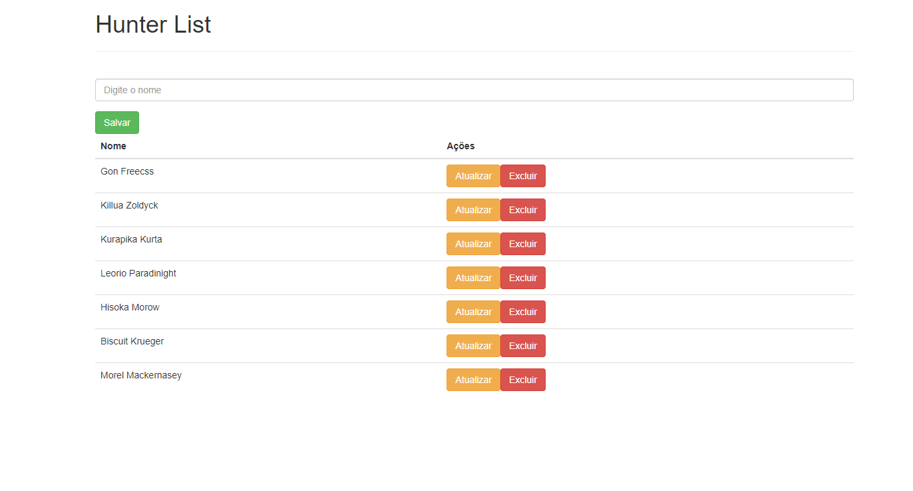

# Sistema CRUD com MongoDB, Node.js e Docker Compose

Este repositório contém o código-fonte de um sistema CRUD (Create, Read, Update, Delete) que utiliza MongoDB como banco de dados, com backend desenvolvido em Node.js.
A aplicação foi projetada para ser facilmente conteinerizada através do Docker Compose, separando as responsabilidades entre backend e frontend, garantindo uma maior modularidade e facilidade de implantação.

## Imagem da tela de cadastro - 

 

